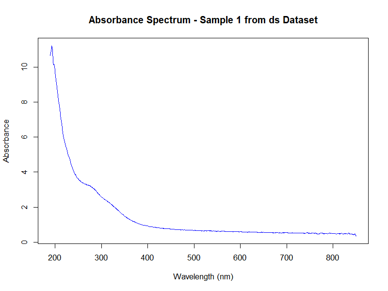
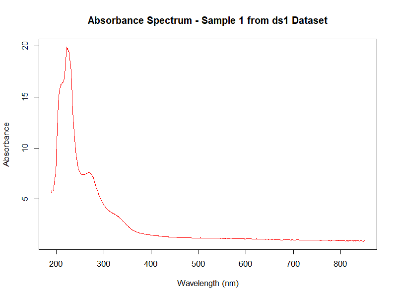
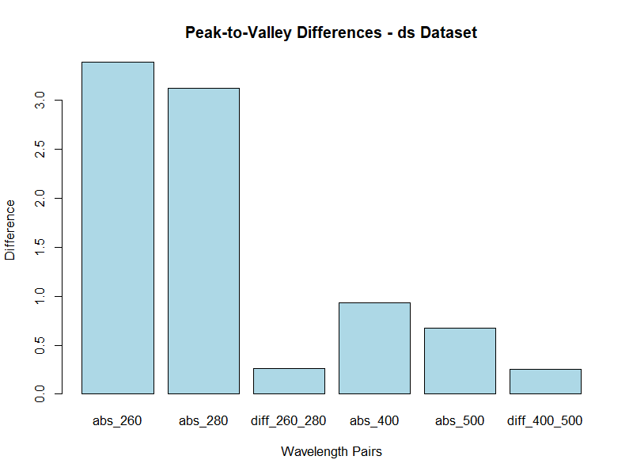

# nanodRop

<!-- badges: start -->
[](https://zenodo.org/badge/latestdoi/798477055)
[](https://opensource.org/licenses/MIT)
[](https://CRAN.R-project.org/package=nanodRop)
[](https://github.com/beabock/nanodRop/actions/workflows/ci.yml)
<!-- badges: end -->

## Table of Contents

- [Overview](#overview)
- [Features](#features)
- [Installation](#installation)
- [Quick Start](#quick-start)
- [Examples](#examples)
- [API Reference](#api-reference)
- [Contributing](#contributing)
- [License](#license)
- [Citation](#citation)

## Overview

nanodRop is an R package designed to simplify the import and processing of spectral data files exported by the NanoDrop One spectrophotometer. It converts raw TSV files into tidy CSV formats that are ready for downstream analysis in R, making spectral data analysis more accessible and efficient.

The package handles the complexities of NanoDrop file formats, including parsing multiple samples, wavelength ranges, and absorbance measurements, while providing clean, analyzable output.

## Features

- **Easy Import**: Direct import of NanoDrop One TSV files
- **Data Cleaning**: Automatic handling of error indicators and data validation
- **Tidy Output**: Converts spectral data to tidy data frames suitable for analysis
- **Flexible Parsing**: Customizable wavelength ranges and sample processing
- **Peak Analysis**: Built-in functions for spectral peak and valley calculations
- **R Integration**: Seamlessly integrates with the tidyverse ecosystem

## Installation

### Development Version

You can install the development version of nanodRop from [GitHub](https://github.com/beabock/nanodRop) with:

```r
# install.packages("devtools")
devtools::install_github("beabock/nanodRop")
```

### CRAN Version (Future Release)

Once available on CRAN:

```r
install.packages("nanodRop")
```

### Requirements

- R (>= 2.10)
- Dependencies: dplyr, purrr, readr, stringr, tidyr

## Quick Start

Load the package and import a NanoDrop file:

```r
library(nanodRop)

# Import spectral data
data <- read_nanodrop("path/to/your/nanodrop_file.tsv")

# View the structure
head(data)
```

## Examples

### Basic Data Import

```r
# Load the package
library(nanodRop)

# Import data from a NanoDrop TSV file
spectral_data <- read_nanodrop("UV-Vis_sample.tsv")

# View the first few rows
head(spectral_data)
#>   samps waves   abs
#> 1     1   190 0.123
#> 2     1   191 0.124
#> 3     1   192 0.125
#> ...
```

### Spectral Analysis

```r
# Parse specific wavelength pairs for peak/valley analysis
parsed_data <- parse_waves(spectral_data,
                          wave_pairs = list(c(300, 400), c(542, 644)))

# View the calculated differences
head(parsed_data)
#>   samps diff_300_400 diff_542_644
#> 1     1       0.045        0.123
#> 2     2       0.052        0.145
#> ...
```

### Working with Example Data

```r
# Load example dataset
data(ds1)

# Perform analysis on example data
results <- parse_waves(ds1)
```

### Sample Visualizations

#### Absorbance Spectra



*Figure 1: Typical absorbance spectrum from the `ds` example dataset, showing UV-Vis absorption across wavelengths.*



*Figure 2: Absorbance spectrum from the `ds1` example dataset, demonstrating spectral data visualization.*

#### Peak-to-Valley Analysis



*Figure 3: Peak-to-valley differences calculated for selected wavelength pairs in the `ds` dataset.*


*Figure 4: Peak-to-valley analysis results for the `ds1` dataset, highlighting spectral features.*

## API Reference

### Core Functions

- [`read_nanodrop()`](man/read_nanodrop.Rd) - Import and process NanoDrop TSV files
- [`parse_waves()`](man/parse_waves.Rd) - Calculate peak-to-valley differences for spectral analysis

### Datasets

- [`ds`](man/ds.Rd) - Example spectral dataset for testing and demonstration

## Contributing

We welcome contributions to nanodRop! Please see our [Contributing Guide](CONTRIBUTING.md) for details on:

- Reporting bugs and issues
- Suggesting new features
- Submitting pull requests
- Code style guidelines

### Development Setup

1. Fork the repository
2. Clone your fork: `git clone https://github.com/yourusername/nanodRop.git`
3. Install development dependencies: `devtools::install_dev_deps()`
4. Make your changes
5. Run tests: `devtools::test()`
6. Submit a pull request

## License

This package is licensed under the MIT License - see the [LICENSE](LICENSE) file for details.

## Citation

If you use nanodRop in your research, please cite:

```bibtex
@misc{bock2024nanodrop,
  title={nanodRop: Tools for Importing and Processing NanoDrop One Spectral Data},
  author={Bock, Beatrice},
  year={2024},
  doi={10.5281/zenodo.12519996}
}
```

For more citation details, see `citation("nanodRop")`.
